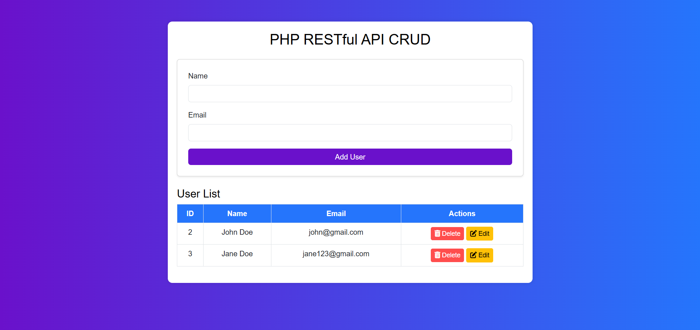

# PHP RESTful API CRUD

This project is a simple RESTful API-based CRUD application using PHP and MySQL. It allows users to **Create, Read, Update, and Delete (CRUD)** records in a MySQL database with an interactive user interface.



---

## 🚀 Features

- **Create** new users with name and email.
- **Read** and display users in a table.
- **Update** user details via a modal form.
- **Delete** users with confirmation.
- **RESTful API** to handle CRUD operations.
- **Bootstrap UI** for a modern and responsive design.

---

## 🛠️ Setup Instructions

### 1️⃣ Clone the Repository

```sh
git clone https://github.com/rahull0328/RESTful-API.git
cd RESTful-API
```

## 2️⃣ Database Setup
- **Open phpMyAdmin.**
- **Create a new database named test.**
- **Import the database.sql file into the database.**

## 3️⃣ Configure Database Connection

```php
$conn = new mysqli("localhost", "root", "", "test");
```

## 4️⃣ Start Local Server
If using XAMPP or WAMP, place the project folder inside htdocs (XAMPP) or www (WAMP). Then start Apache and MySQL
Run the project in your browser:

```bash
http://localhost/RESTful-API/index.php
```

---

## 🎨 Technologies Used
- PHP (Backend)
- MySQL (Database)
- Bootstrap 5 (Frontend)
- FontAwesome (Icons)
- AJAX (jQuery) (For requests)